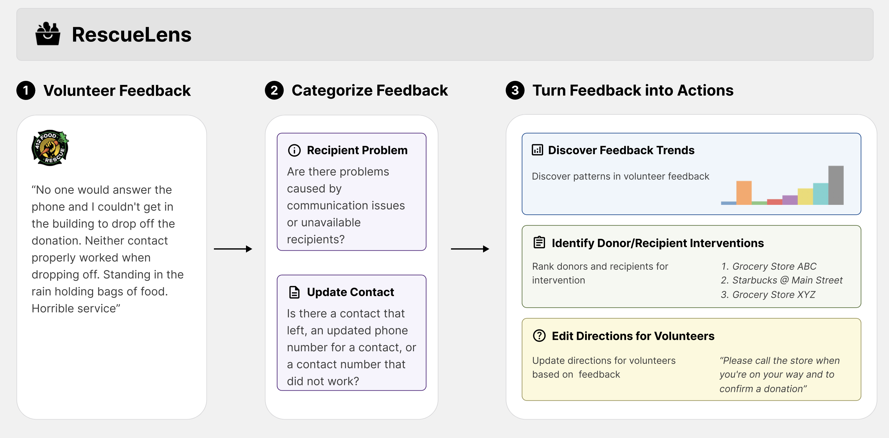

# RescueLens: LLM-Powered Triage and Action on Volunteer Feedback for Food Rescue



This repository contains the implementation for the paper:  **"RescueLens: LLM-Powered Triage and Action on Volunteer Feedback for Food Rescue"**.

This work was done by [Naveen Raman](https://naveenraman.com/), [Jingwu Tang](https://tangjingwu.com), [Zhiyu Chen](https://czyssrs.github.io), [Ryan Shi](https://ryanzshi.github.io), [Sean Hudson](https://www.linkedin.com/in/sean-hudson-ba9b8759/), [Ameesh Kapoor](https://www.linkedin.com/in/ameeshkapoor/), [Fei Fang](https://feifang.info). 

#### TL;DR 
Food rescue organizations simultaneously tackle food insecurity and waste by working with volunteers to redistribute food from donors who have excess to recipients who need it. Volunteer feedback allows food rescue organizations to identify issues early and ensure volunteer satisfaction. However, food rescue organizations monitor feedback manually, which can be cumbersome and labor-intensive, making it difficult to prioritize which issues are most important. RescueLens is an LLM-powered tool that helps food rescue organizations efficiently triage volunteer feedback. It automatically categorizes issues, suggests follow-ups with donors and recipients, and updates volunteer directions.  On an annotated dataset, it recovers 96% of volunteer issues at 71% precision.  Through organizer interviews, we find that RescueLens streamlines the feedback process and improves resource allocation. RescueLens is deployed at [412 Food Rescue](https://412foodrescue.org) in Pittsburgh, Pennsylvania.  

---

## Setup

### 1. Clone the repository
```bash
git clone https://github.com/naveenr414/food_rescue_feedback
cd food_rescue_feedback
```

### 2. Install dependencies
```bash
pip install -e .
pip install -r requirements.txt
```

### 3. Verify installation
```python
import feedback
```

## Usage

### Labeled Feedback

RescueLens supports two modes for labeling feedback:

- **Batch mode** (recommended for large datasets)  
    ```bash
    python batch_make_requests.py --start_date 2024-01-01 --end_date 2024-01-02
    python batch_process_requests.py
    ```
    - `batch_make_requests.py`: sends requests to the OpenAI Batch API.  
    - `batch_process_requests.py`: checks for completion and writes predictions to the database.  

- **Non-batch mode** (simpler, but slower)  
    ```bash
    python generate_feedback.py --start_date 2024-01-01 --end_date 2024-01-02
    ```
    Writes predictions directly to the **rescue_feedback** table.

**Required environment variables:**  
`POSTGRES_DB`, `POSTGRES_USER`, `POSTGRES_PASSWORD`, `DATABASE_HOST`, `DATABASE_PORT`, `OPENAI_API_KEY`.

---

## Evaluation

Evaluation scripts (LLM and non-LLM baselines) are available in:  
```  
scripts/notebooks/Evaluation.ipynb  
```

---

## Direction Rewrite

To rewrite volunteer directions:  
1. Fetch directions for a chosen date range.  
2. Use the prompt in ```data/prompts/update_direction.txt```.  
3. Run the notebook ```scripts/notebooks/Direction Rewrite.ipynb```.  
4. Rewritten instructions are saved to:  
   ```data/annotations/rewritten_instructions_2024.csv```

---

## Ranked Donors & Recipients

Ranked lists of donors and recipients are generated in:  
```scripts/notebooks/Plotting.ipynb```

Results are saved to:  
- ```data/annotations/ranked_donors.csv```  
- ```data/annotations/ranked_recipients.csv```

---
